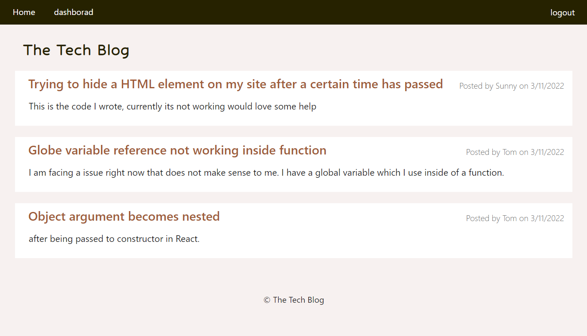
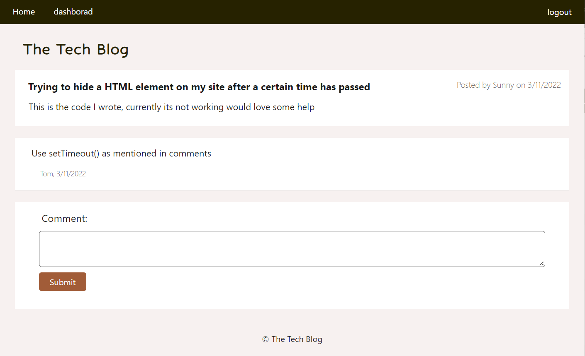

# Small Topic
 
## Description 
This project is a CMS-style site where developers can publish their blog posts and comment on other developer's posts as well.

It followed the MVC paradigm in its architectural structure, using Handlebars.js as the templating language, Sequelize as the ORM, and the express-session npm package for authentication.
## Usage
visit the website: <a href="https://small-topic.herokuapp.com/">small-topic.herokuapp.com</a>
## Screenshot
 

 

## Links

<a href="https://small-topic.herokuapp.com/" target="_blank">https://small-topic.herokuapp.com</a>

<a href="https://github.com/Yanbud/small-topic">https://github.com/Yanbud/small-topic</a>

## License
This project is licensed under the MIT license.
